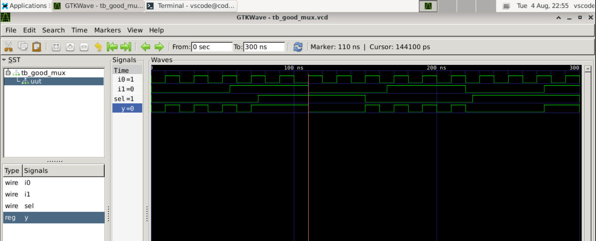
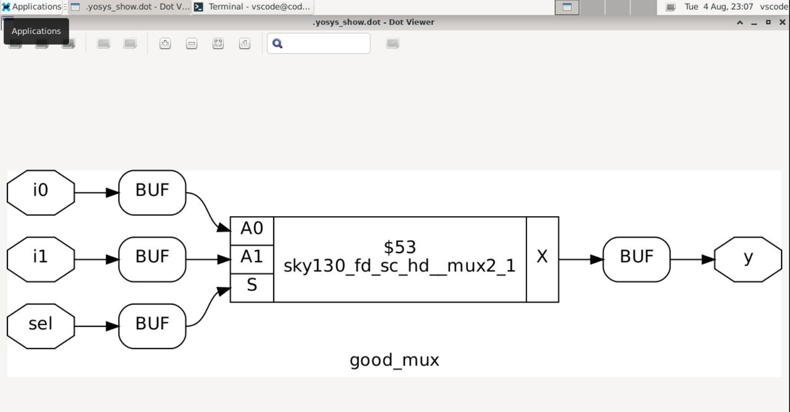

# Day 1 - Digital Logic Simulation and Technology Synthesis Walkthrough

This log documents the practical lab work completed on Day 1, focused on verifying RTL code using Icarus Verilog (iverilog) and translating it into a hardware netlist using Yosys against the SkyWater 130nm process cell library.

---

## 1. Core Framework: Core Definitions
To successfully test a digital circuit before fabrication, we use a three-part framework:
* **The Design Module:** The core Verilog description containing the actual behavioral or structural hardware logic.
* **The Testbench:** An external test setup file that feeds various input combinations into the design module to check its output behavior.
* **The Simulation Environment:** The engine that processes both files, running through time steps to produce a Value Change Dump (`.vcd`) wave layout.

---

## 2. Practical Lab: Simulating a 2-to-1 Multiplexer
We verified the design of a fundamental 2:1 Multiplexer block using open-source terminal tools.

### Step-by-Step Terminal Steps:
```bash
# 1. Compile the hardware description and testbench files together
iverilog good_mux.v tb_good_mux.v

# 2. Run the generated simulation application
./a.out

# 3. Bring up the waveform output workspace in the background
gtkwave tb_good_mux.vcd &
```

### Waveform Display Verification:
The output waveform below confirms that the selection logic correctly routes inputs based on the state of the select line:


---

## 3. RTL Code Interpretation
The behavioral implementation of our design (`good_mux.v`) follows standard conditional routing:

```verilog
module good_mux (input i0, input i1, input sel, output reg y);
always @ (*)
begin
    if(sel)
        y <= i1;
    else 
        y <= i0;
end
endmodule
```
* **Inputs/Outputs:** The module captures two data paths (`i0`, `i1`) and one control pin (`sel`) to feed a single registered output (`y`).
* **Logic Flow:** The combinational sensitivity block (`@ *`) monitors all signal shifts. When `sel` goes high (`1`), `y` follows `i1`. Otherwise, it outputs `i0`.

---

## 4. Understanding Logic Synthesis & Cell Variations
Logic synthesis with **Yosys** is the stage where abstract code transforms into a concrete structural gate schematic. 

### Why Technology Files (.lib) Containerize Diverse Cell Types:
A cell library contains multiple versions of standard logic blocks (like AND or XOR gates). Yosys picks different cell variants depending on design constraints:
* **Timing Optimization:** Larger gates provide higher current drive to speed up critical signals across long traces.
* **Power Preservation:** Smaller, slower gates are mapped to non-critical paths to minimize power leakage.
* **Area Management:** Compact layouts are prioritized to fit more logic onto smaller, lower-cost silicon footprints.

---

## 5. Logic Synthesis Lab with Yosys
We executed synthesis on our design, mapping generic logic structures down to physical hardware definitions.

### Executed Tool Settings:
```yosys
yosys> read_liberty -lib lib/sky130_fd_sc_hd__tt_025C_1v80.lib
yosys> read_verilog verilog_files/good_mux.v
yosys> synth -top good_mux
yosys> abc -liberty lib/sky130_fd_sc_hd__tt_025C_1v80.lib
yosys> show
```

### Technology-Mapped Structural Layout:
The final hardware block schematic produced by Yosys shows the physical gate connections:


