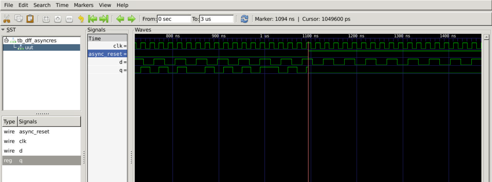
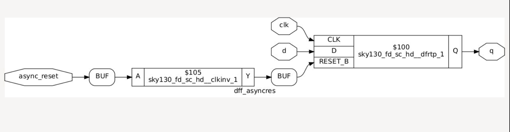
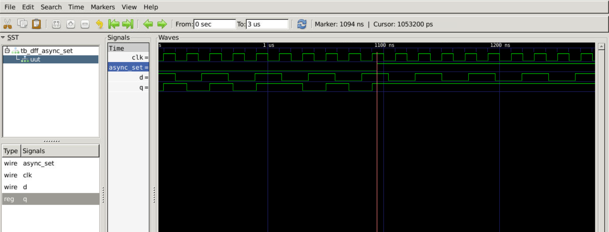
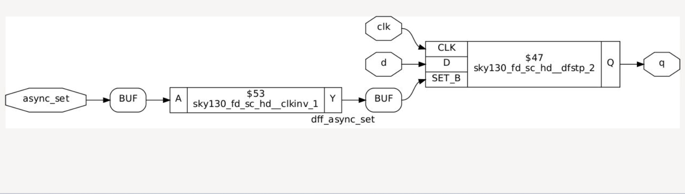
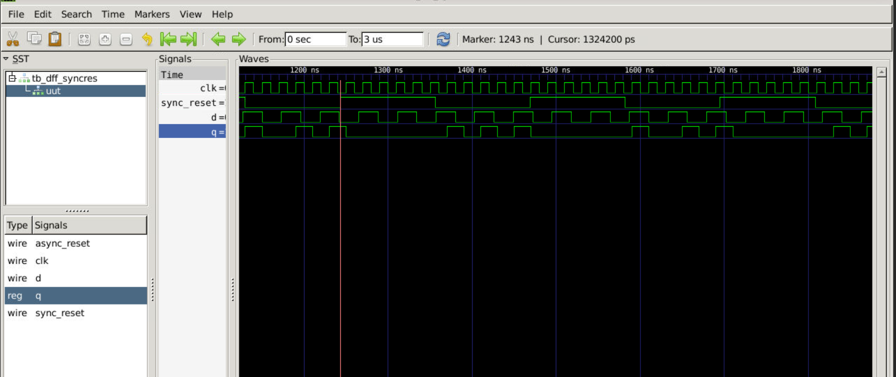
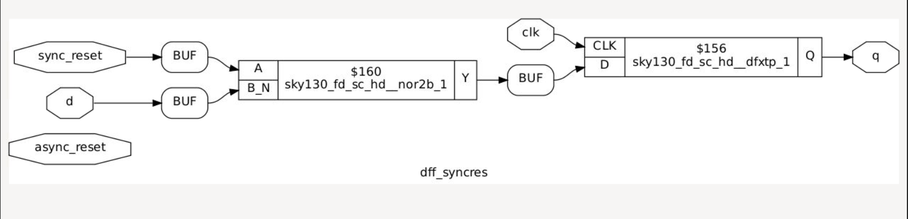
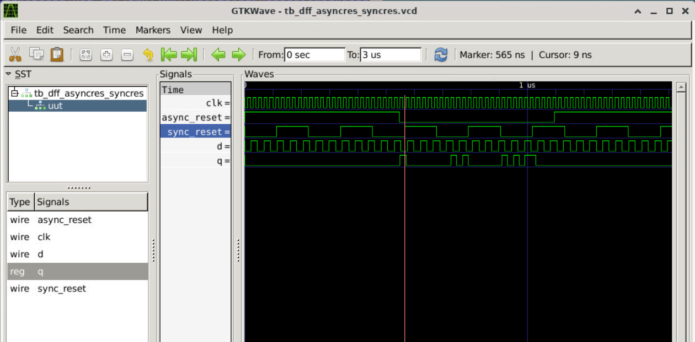
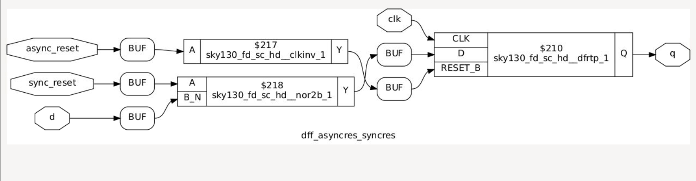

# Day 2 - Timing Libraries, Synthesis Approaches, and Efficient Flip-Flop Coding

This folder contains the practical labs and results for Day 2 of the VSD workshop.

---

## 1. Hierarchical vs Flat Synthesis
Analyzed how Yosys handles sub-modules using the `multiple_modules.v` file.

* **Hierarchical View:** Sub-module structures are preserved as clean blocks.
  
* **Flat View:** Module walls are deleted using the `flatten` command, showing all raw gates.
  

---

## 2. D Flip-Flop Coding Styles and Reset Behaviors

Sequential storage elements process control signals differently based on whether they trigger immediately or wait for a clock edge. We simulated and synthesized multiple flip-flop variations to analyze their hardware behavior.

---

### Case A: Asynchronous Reset D Flip-Flop
This design variant responds instantly to the reset signal. The output drops to zero the exact moment the reset line is pushed, running independently of the active clock edge.

* **Verilog Source Code:**
```verilog
module dff_asyncres (input clk, input async_reset, input d, output reg q);
always @ (posedge clk, posedge async_reset)
begin
    if (async_reset)
        q <= 1'b0;
    else
        q <= d;
end
endmodule
```

* **Functional Simulation Waveform:**
  

* **Synthesized Gate Schematic:**
  

---

### Case B: Asynchronous Set D Flip-Flop
This structure handles active-high override signals by forcing the storage pin high immediately. The state updates to a constant binary high state without waiting for a clock synchronization event.

* **Verilog Source Code:**
```verilog
module dff_async_set (input clk, input async_set, input d, output reg q);
always @ (posedge clk, posedge async_set)
begin
    if (async_set)
        q <= 1'b1;
    else
        q <= d;
end
endmodule
```

* **Functional Simulation Waveform:**
  

* **Synthesized Gate Schematic:**
  

---

### Case C: Synchronous Reset D Flip-Flop
Unlike asynchronous blocks, this control scheme samples the clear signal conditionally. The output only resets to zero if the reset signal is active at the precise moment a rising clock edge arrives.

* **Verilog Source Code:**
```verilog
module dff_syncres (input clk, input sync_reset, input d, output reg q);
always @ (posedge clk)
begin
    if (sync_reset)
        q <= 1'b0;
    else
        q <= d;
end
endmodule
```

* **Functional Simulation Waveform:**
  

* **Synthesized Gate Schematic:**
  

---

### Case D: Combined Asynchronous Reset & Synchronous Set
This advanced sequential circuit maps concurrent priorities. It checks for an immediate, clock-independent override reset before checking for standard synchronous set actions tied to the active clock track.

* **Verilog Source Code:**
```verilog
module dff_asyncres_syncres (input clk, input async_reset, input sync_set, input d, output reg q);
always @ (posedge clk, posedge async_reset)
begin
    if (async_reset)
        q <= 1'b0;
    else if (sync_set)
        q <= 1'b1;
    else
        q <= d;
end
endmodule
```

* **Functional Simulation Waveform:**
  

* **Synthesized Gate Schematic:**
  


## 3. Multiplier Optimization (Special Case)
Synthesized a 2-bit multiplier design (`mul2`). Because multiplying by 2 in binary is just shifting bits left, Yosys optimized away all physical logic gates and used pure wire connections instead.

* **Mul2 Netlist:**

```verilog
module mul2(a, y);
  wire [31:0] _0_;
  input [2:0] a;
  output [3:0] y;
  assign _0_ = a * 32'd2;
  assign y = _0_[3:0];
endmodule
```

* **Mul2 Schematic Layout:** (Shows the physical bit-shift wiring block)
  

Synthesized an 8-bit multiplier design (mult8). Because this specific design assigns the input directly to itself duplicated, Yosys optimizes the operation entirely into a bitwise wire duplication logic pass ({a, a}). The synthesis engine completely removes the multiplier block and hooks up the copper wire routes directly, leaving zero physical logic cells in the final circuit layout.

* **Mul8 Netlist:**

```verilog
module mult8(a, y);
  input [2:0] a;
  output [5:0] y;
  assign y = { a, a };
endmodule
```

* **Mul8 Schematic Layout:**
  
  
