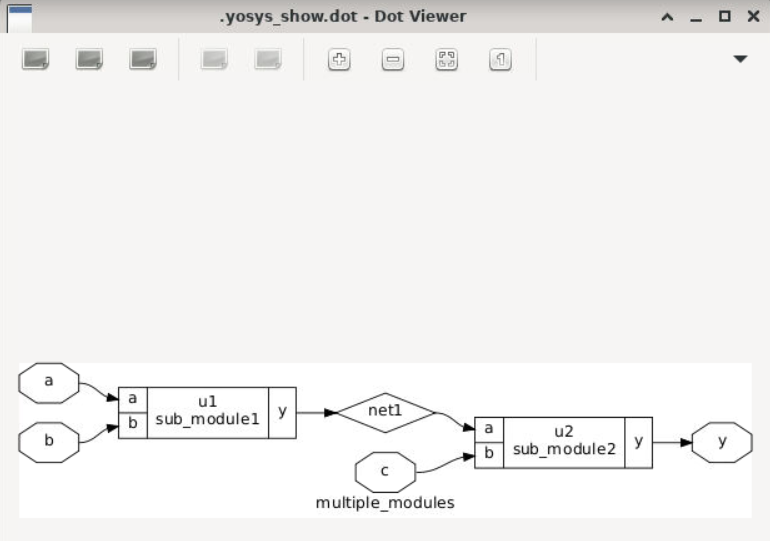
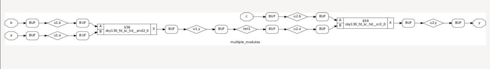
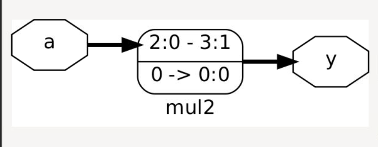
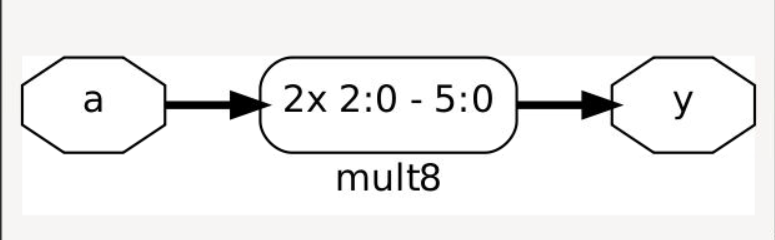

# Day 2 - Timing Libraries, Synthesis Approaches, and Efficient Flip-Flop Coding

This folder contains the practical labs and results for Day 2 of the VSD workshop.

---

## 1. Hierarchical vs Flat Synthesis
Analyzed how Yosys handles sub-modules using the `multiple_modules.v` file.

* **Hierarchical View:** Sub-module structures are preserved as clean blocks.
  
* **Flat View:** Module walls are deleted using the `flatten` command, showing all raw gates.
  

---

## 2. D Flip-Flop Coding Styles
Simulated an Asynchronous D Flip-Flop design (`dff_async_set.v`) to watch its behavioral timing waves.

* **Simulation Waveform:**
  

---

## 3. Multiplier Optimization (Special Case)
Synthesized a 2-bit multiplier design (`mul2`). Because multiplying by 2 in binary is just shifting bits left, Yosys optimized away all physical logic gates and used pure wire connections instead.

* **Mul2 Netlist:**

```verilog
module mul2(a, y);
  wire [31:0] _0_;
  input [2:0] a;
  output [3:0] y;
  assign _0_ = a * 32'd2;
  assign y = _0_[3:0];
endmodule
```

* **Mul2 Schematic Layout:** (Shows the physical bit-shift wiring block)
  

* **Mul8 Netlist:**

```verilog
module mult8(a, y);
  input [2:0] a;
  output [5:0] y;
  assign y = { a, a };
endmodule
```

* **Mul8 Schematic Layout:**
  
  
