# Day 3 - Combinational and Sequential Optimizations

## 1. Introduction to Optimizations
An optimized design is highly efficient in terms of circuit area and power consumption. Optimization happens during synthesis when the tool analyzes the RTL logic expressions and maps them to the minimal number of technology standard cells from the `.lib` file.

### Combinational Logic Optimization
Techniques used for Combinational Logic Optimization:
* **Constant Propagation:** If any input of a logic gate is a constant value (e.g., tied to Ground or VDD), the tool simplifies the Boolean expression to eliminate unnecessary inputs or gates.
* **Boolean Logic Optimization:** The tool uses Boolean algebraic laws to simplify complex logic structures (e.g., Karnaugh maps and Quine-McCluskey logic reductions done by the compiler).

### Sequential Logic Optimization
Techniques used for Sequential Logic Optimization:
* **Sequential Constant Propagation:** If a flip-flop's input is a constant value, the register may always maintain a constant state, allowing the tool to optimize it out entirely.
* **State Optimization:** Elimination of unused, redundant, or unreachable finite state machine (FSM) states.
* **Retiming:** Shifting the positions of flip-flops across combinational logic boundaries to improve clock frequency and timing margins without changing circuit functionality.
* **Sequential Logic Cloning (Floor Plan Aware Synthesis):** Replicating a register that drives logic blocks placed very far apart on the physical floorplan to avoid timing violations caused by long wire delays.

---

## 2. Combinational Logic Optimizations (Labs)

### Lab 1: Optimizing Simple Expressions (`opt_check.v`)
The module `opt_check` represents a simple logic expression with a constant input.

**Yosys Execution Commands:**
```bash
\$ yosys
yosys> read_liberty -lib ../my_lib/lib/sky130_fd_sc_hd__tt_025C_1v80.lib
yosys> read_verilog opt_check.v
yosys> synth -top opt_check
yosys> opt_clean -purge
yosys> abc -liberty ../my_lib/lib/sky130_fd_sc_hd__tt_025C_1v80.lib
yosys> show -format png -prefix opt_check_mapped
```

**Results & Technical Analysis:**


* **Analysis:** Because one input of the internal expression is hardwired to a constant value, Yosys propagates this value through the expression. The logic simplifications drastically reduce the required gate count, resulting in an area-optimized layout mapped to the Sky130 library cells.

---

### Lab 2: Optimizing Multiple Outputs (`opt_check2.v`)
This lab checks optimization choices across multiple output ports driven by related logic paths.

**Yosys Execution Commands:**
```bash
yosys> read_verilog opt_check2.v
yosys> synth -top opt_check2
yosys> opt_clean -purge
yosys> abc -liberty ../my_lib/lib/sky130_fd_sc_hd__tt_025C_1v80.lib
```

**Results & Technical Analysis:**


* **Analysis:** Yosys looks across all distinct output branches. When multiple outputs share an identical boolean sub-expression or depend on common constant inputs, the synthesis tool shares physical standard cell gates to drive both pins, preserving area.

---

### Lab 3: Advanced Combinational Check (`opt_check3.v`)
**Results & Technical Analysis:**
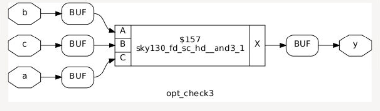
* **Analysis:** This lab demonstrates how multi-input boolean structures are crushed down. Complex nested logic structures evaluate to simpler algebraic equivalents when fixed constraints are applied to the primary input boundaries.

---

### Lab 4: Complex Multi-Level Optimization (`opt_check4.v`)
**Results & Technical Analysis:**
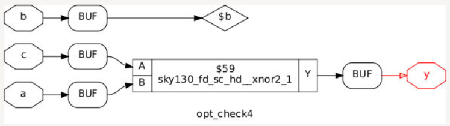
* **Analysis:** Yosys tracks paths through multiple layers of combinational logic. Constant propagation sweeps through deep cascading levels, cleaning out dead networks and replacing massive logic groupings with direct ties or single standard gates.

---

### Lab 5: Sub-Module Hierarchical Optimization (`multiple_module.v`)
We analyze how Yosys performs flat versus hierarchical tracking for optimization paths across multiple boundary modules.

* **Hierarchical Logic Optimization Check:**
  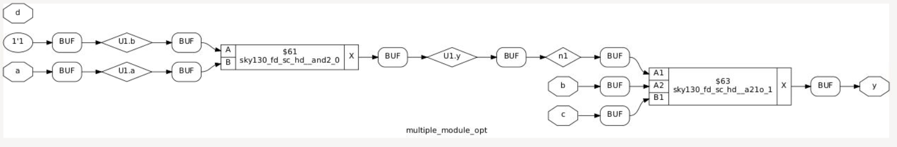
* **Flattened Module Logic Optimization Check:**
  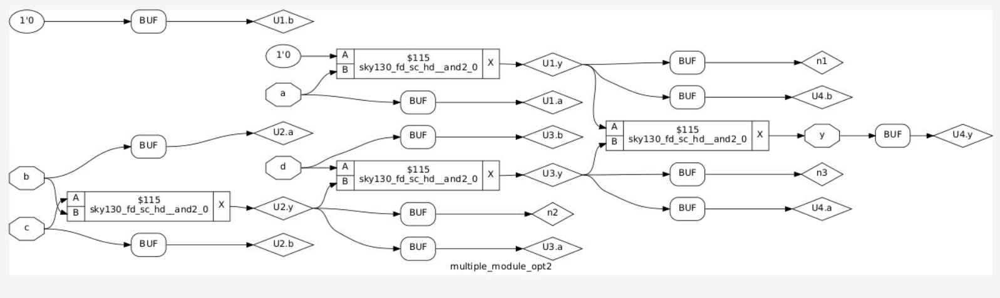
* **Analysis:** When optimized hierarchically, Yosys leaves sub-module boundaries intact, preventing optimization passes from crossing module lines. Flattening the design removes these artificial sub-module boundaries, enabling global optimizations that yield a tighter gate-level configuration.

---

## 3. Sequential Logic Optimizations (Labs)

### Lab 1: Sequential Constant Propagation 1 (`dff_const1.v`)
**Yosys Execution Commands:**
```bash
\$ yosys
yosys> read_liberty -lib ../my_lib/lib/sky130_fd_sc_hd__tt_025C_1v80.lib
yosys> read_verilog dff_const1.v
yosys> synth -top dff_const1
yosys> opt_clean -purge
yosys> abc -liberty ../my_lib/lib/sky130_fd_sc_hd__tt_025C_1v80.lib
```

**Results & Technical Analysis:**
* 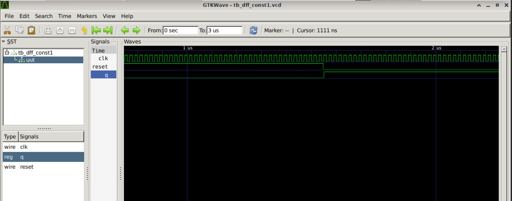
* 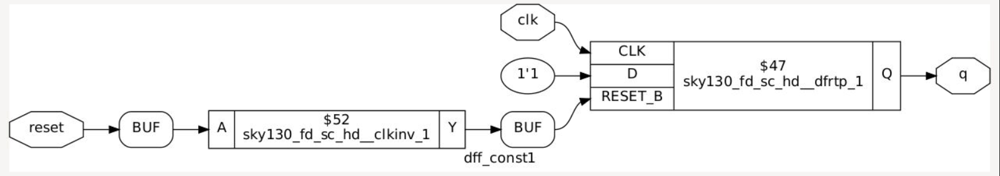
* **Analysis:** The input `D` is tied to a constant logic high value (`1'b1`) with no reset condition. Because the value of `D` never toggles and there is no asynchronous override condition to change `Q`, Yosys identifies the register as a dead tracking element. The physical D-Flip-Flop is deleted entirely during the `opt_clean -purge` pass, and the output net `Q` is hardwired directly to the power rail (VDD).

---

### Lab 2: Sequential Constant Propagation 2 (`dff_const2.v`)
**Results & Technical Analysis:**
* 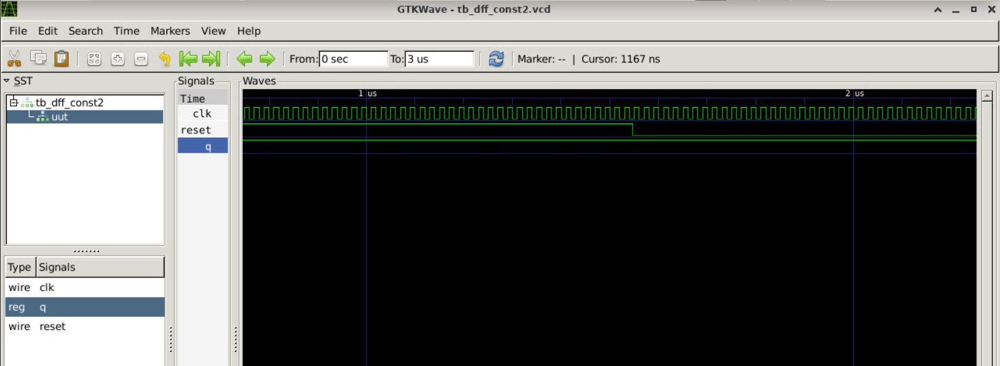
* 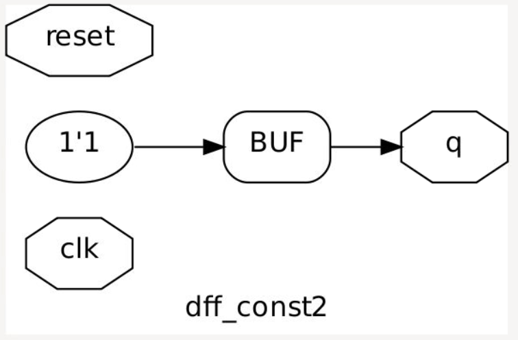
* **Analysis:** The input `D` is tied to an operational constant value (`1'b1`), but the block includes an active-high asynchronous reset pin forcing the output `Q` to logic low (`1'b0`). Because the reset state (`0`) is the inverse of the operational steady state (`1`), the circuit must retain its memory element. Yosys cannot optimize away the sequential cell and retains a physical hardware D-Flip-Flop instance (`sky130_fd_sc_hd__dfrtp`).

---

### Lab 3: Sequential Constant Propagation 3 (`dff_const3.v`)
**Results & Technical Analysis:**
* 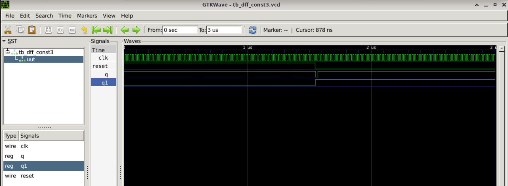
* 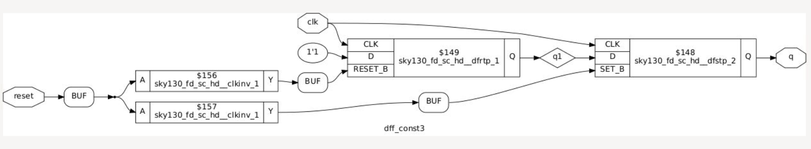
* **Analysis:** In `dff_const3`, input `D` is tied to constant logic high (`1'b1`), and the active-high reset also forces the output `Q` to logic high (`1'b1`). Since the clocked steady-state value perfectly matches the reset override value, the output net `Q` will never transition to `0`. The memory cell is completely redundant, so Yosys purges the physical D-Flip-Flop and shorts the output pin directly to the VDD power rail.

---

### Lab 4: Sequential Constant Propagation 4 (`dff_const4.v`)
**Results & Technical Analysis:**
* 
* 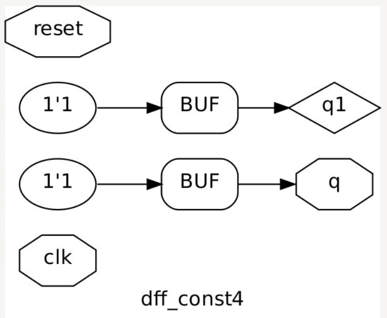
* **Analysis:** This module uses an active-low asynchronous control structure. The input `D` is tied to a constant logic low (`1'b0`), while an active-low clear/set pin forces the output `Q` to logic high (`1'b1`) when pulled low (`0`). The default clocked state (`0`) differs from the control override state (`1`). Yosys must preserve the register to manage the state boundary transition and maps it to a specialized Sky130 technology cell containing an inverted preset port (`sky130_fd_sc_hd__dfrbp`).

---

### Lab 5: Sequential Constant Propagation 5 (`dff_const5.v`)
**Results & Technical Analysis:**
* 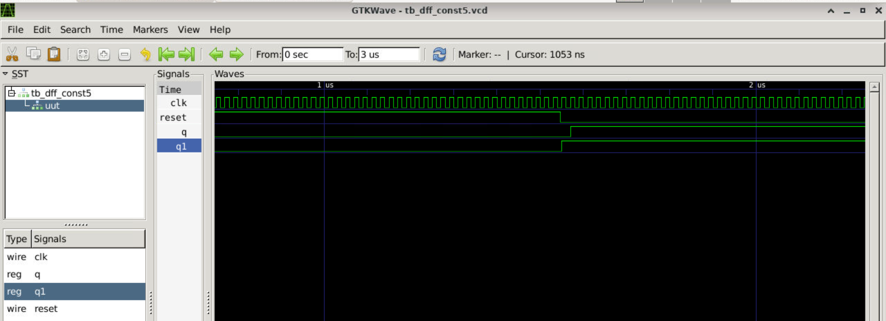
* 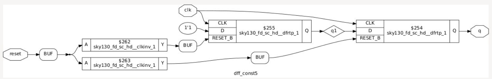
* **Analysis:** In `dff_const5`, the input `D` is tied to constant logic high (`1'b1`), and an active-low asynchronous control input overrides the output `Q` to force it to logic high (`1'b1`). Because the steady-state logic level matches the active-low override value, the register can never hold or output a logic low (`0`) state. The flip-flop is optimized out, and the net is hooked directly to the primary power rail.

---

### Lab 6: Counter Logic Optimization (`counter_opt.v`)
Analysis of unused bits or dead-state terminal count loop trimming during synthesis iterations.

**Results & Technical Analysis:**
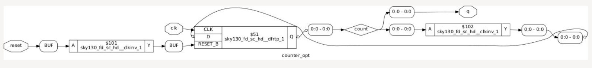
* **Analysis:** When a multi-bit counter is designed but only a fraction of its primary bit outputs are actually hooked up to drive external ports or logic, the remaining upper bits are classified as dead logic tracking. During synthesis optimization iterations, Yosys cleans up and deletes these unused tracking flip-flops to minimize silicon overhead.
