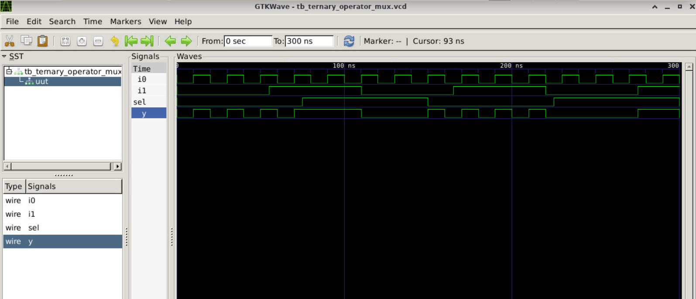
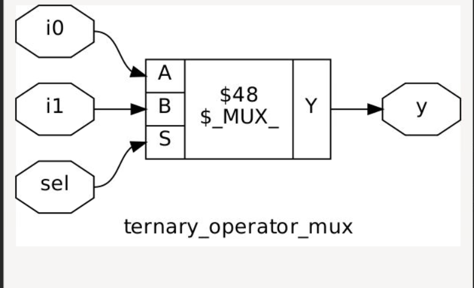
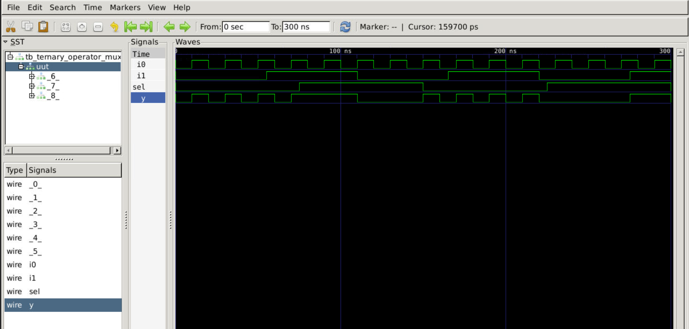
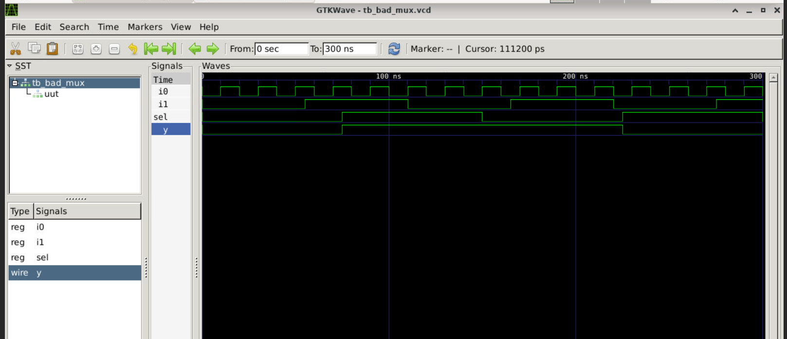
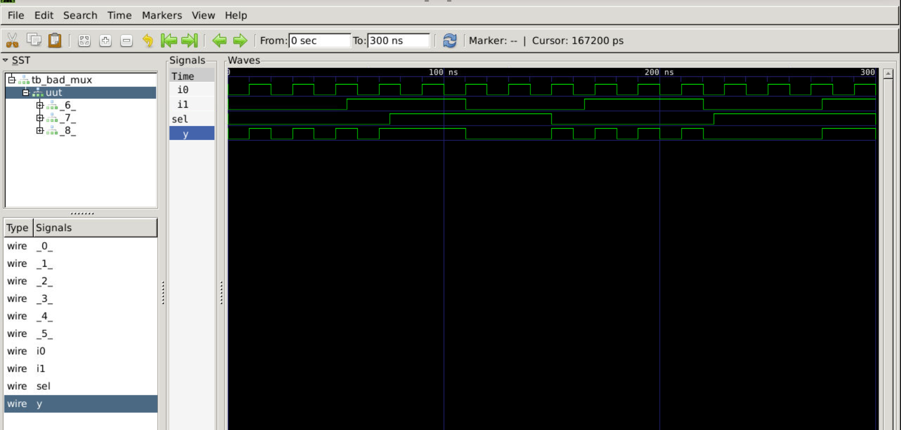
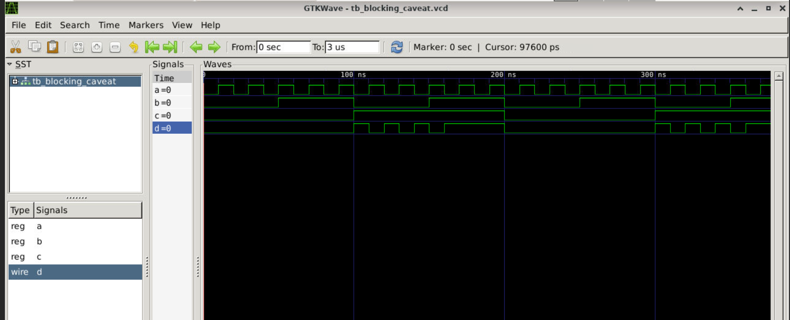
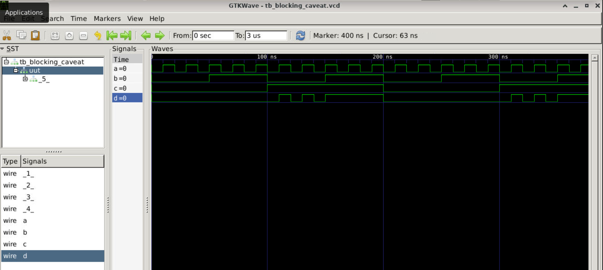

# Day 4: Gate-Level Simulation (GLS), Blocking vs. Non-Blocking, and Synthesis-Simulation Mismatch

## 1. Gate-Level Simulation (GLS)
Gate-Level Simulation (GLS) is a verification step in the ASIC design flow where the synthesized netlist is simulated to validate functional correctness, timing behavior, and power estimations. 

### Why Perform GLS?
* **Synthesis Validation:** Ensures that the synthesis tool faithfully translated the behavioral RTL description into gate-level structures.
* **Timing Verification:** Simulates real-world circuit delays (using Standard Delay Format - `.sdf` files) to check for setup and hold timing violations.
* **Testability Check:** Confirms that Design for Testability (DFT) structural architectures, like scan chains, function correctly post-synthesis.

---

## 2. Synthesis-Simulation Mismatch
A synthesis-simulation mismatch occurs when the behavioral simulation results of the pre-synthesis RTL do not match the simulation results of the post-synthesis netlist. 

### Core Drivers of Mismatches:
* **Missing Sensitivity Lists:** In behavioral combinational blocks, omitting inputs from the sensitivity list causes the simulator to skip evaluation when those unlisted signals toggle. Yosys ignores this restriction, resulting in divergent functionality.
* **Incorrect Procedural Operator Selection:** Using sequential non-blocking assignments inside combinational evaluation logic blocks.
* **Non-Synthesizable Constructs:** Using simulation runtime constructs (such as initial delays or explicit initialization loops) that cannot map to standard hardware cells.

---

## 3. Blocking vs. Non-Blocking Assignments in Verilog

### 3.1 Blocking Statements (`=`)
* **Syntax:** `y = a & b;`
* **Execution:** Evaluated and updated sequentially, executing immediately within the step block.
* **Usage:** Strictly reserved for pure combinational logic blocks (`always @(*)`).

### 3.2 Non-Blocking Statements (`<=`)
* **Syntax:** `q <= d;`
* **Execution:** Evaluated concurrently, scheduling assignment updates to apply at the conclusion of the current time step.
* **Usage:** Strictly reserved for clocked sequential logic blocks (`always @(posedge clk)`).

### 3.3 Structural Comparison Matrix

| Attribute | Blocking (`=`) | Non-Blocking (`<=`) |
| :--- | :--- | :--- |
| **Execution Paradigm** | Sequential, immediate execution | Concurrent, scheduled at end of time step |
| **Variable Modification** | Value updates apply instantly in code order | Value updates defer until time step closes |
| **Target Application** | Combinational networks and intermediate paths | Sequential registers and flip-flops |
| **Synthesized Outcome** | Combinational logic gates | Sequential storage nodes (Flip-Flops) |

### 3.4 Caveats of Blocking Assignments

Using blocking assignments (`=`) inside structured blocks can cause severe hardware bugs. This guide contrasts sequential pipeline bypassing with combinational simulation-synthesis mismatches.
---

### Caveat 1: Sequential Shift-Register Bypass

Using blocking assignments inside clocked `always` blocks creates unwanted combinational paths instead of sequential register stages.

#### Broken Sequential RTL (`blocking_seq.v`)
```verilog
always @(posedge clk) begin
    q1 = d;  // d is instantly copied to q1
    q  = q1; // q reads the fresh q1 value on the same clock edge
end
```

#### Hardware & Simulation Impact
* **The Bug:** Instead of a 2-stage shift register ($d \rightarrow q1 \rightarrow q$) that shifts data by one clock cycle per stage, the intermediate step is optimized away.
* **The Result:** Data propagates from input `d` directly to output `q` in a single clock cycle, violating expected timing behaviors and inducing race conditions.
* **The Fix:** Always use **non-blocking assignments (`<=`)** for clocked sequential logic.
---

### Caveat 2: Combinational Ordering & Stale-Data Flaws

Using incorrect statement ordering inside combinational `always @(*)` blocks forces simulators to use stale data, triggering a simulation-synthesis mismatch.

#### Broken vs. Correct Combinational RTL

##### Broken Implementation (Stale Value / Latch Mimic)
```verilog
always @(*) begin
    y = q0 & c;  // Uses STALE value of q0 from previous evaluation cycle
    q0 = a | b;  // Updated too late for 'y' to use it in this pass
end
```

##### Correct Implementation (Pure Combinational)
```verilog
always @(*) begin
    q0 = a | b;  // Updated first
    y = q0 & c;  // Uses FRESH value of q0 immediately
end
```

#### Hardware & Simulation Impact
* **The Bug:** In simulation, `y` updates using the old value of `q0` from the previous evaluation cycle, mimicking an unintended memory latch.
* **The Mismatch:** Synthesis tools ignore step order and optimize the broken code into a pure combinational circuit (`y = (a | b) & c`). This causes functional mismatches between RTL simulation and gate-level netlists.
* **The Fix:** Inside combinational blocks, always write assignments in topological order—variables must be written before they are read.


## 4. Labs

### Lab 1: Ternary Operator MUX (`ternary_operator_mux.v`)
**RTL Source Code:**
```verilog
module ternary_operator_mux (input i0, input i1, input sel, output y);
  assign y = sel ? i1 : i0;
endmodule
```

**Results & Technical Analysis:**

* **Analysis:** The ternary assignment maps directly to clean combinational evaluation. Pre-synthesis functional verification shows an ideal, glitch-free 2:1 multiplexing waveform where the output tracker `y` instantly follows either `i1` or `i0` based on the status of the select line.

---

### Lab 2: Synthesis Using Yosys
**Yosys Command Execution:**
```bash
\$ yosys
yosys> read_liberty -lib ../my_lib/lib/sky130_fd_sc_hd__tt_025C_1v80.lib
yosys> read_verilog ternary_operator_mux.v
yosys> synth -top ternary_operator_mux
yosys> abc -liberty ../my_lib/lib/sky130_fd_sc_hd__tt_025C_1v80.lib
```

**Results & Technical Analysis:**


* **Analysis:** The synthesis tool analyzes the continuous conditional evaluation operator and maps it to a standard combinational multiplexer cell layout from the SkyWater 130nm library (`sky130_fd_sc_hd__mux2_1`). No memory loops or latches are inferred.

---

### Lab 3: Gate-Level Simulation (GLS) of MUX
**Terminal Execution Flow:**
```bash
\$ iverilog ../my_lib/verilog_model/primitives.v ../my_lib/verilog_model/sky130_fd_sc_hd.v ternary_operator_mux_netlist.v tb_ternary_operator_mux.v
\$ vvp a.out
\$ gtkwave dump.vcd
```

**Results & Technical Analysis:**

* **Analysis:** By compiling the design netlist with the core Sky130 technology standard cell behavioral definitions (`primitives.v`, `sky130_fd_sc_hd.v`), the output waveform validates that the post-synthesis hardware exactly matches the original functional RTL requirements.

---

### Lab 4: Bad MUX Example (Common Pitfalls) (`bad_mux.v`)
**RTL Source Code:**
```verilog
module bad_mux (input i0, input i1, input sel, output reg y);
  always @ (sel) begin
    if (sel)
      y <= i1;
    else 
      y <= i0;
  end
endmodule
```

**Results & Technical Analysis:**

* **Analysis:** This design introduces two fatal bugs: an incomplete sensitivity list (`always @(sel)`) and non-blocking statements inside a combinational evaluation block. During RTL simulation, if `sel` is constant but `i0` or `i1` switches values, the simulator skips the code block entirely. This creates a severe behavior gap compared to synthesized hardware.

---

### Lab 5: GLS of Bad MUX
**Results & Technical Analysis:**

* **Analysis:** Running a post-synthesis GLS on the generated netlist exposes the simulation-synthesis mismatch. The synthesis engine automatically treats the circuit as a combinational path or infers storage latches, causing the netlist simulation waveform to differ dramatically from the buggy RTL simulation execution graph.

---

### Lab 6: Blocking Assignment Caveat (`blocking_caveat.v`)
**RTL Source Code:**
```verilog
module blocking_caveat (input a, input b, input c, output reg d);
  reg x;
  always @ (*) begin
    d = x & c;
    x = a | b;
  end
endmodule
```

**Results & Technical Analysis:**

* **Analysis:** Because the statements run immediately in sequential code order, the value of `d` is evaluated using the *previous* or stale value of internal variable `x` from the prior simulation step, rather than using the updated `a | b` calculation. This race condition causes the logic to simulate like a shift register or memory node.

---

### Lab 7: Synthesis of the Blocking Caveat Module
**Results & Technical Analysis:**

* **Analysis:** To resolve the mismatch, the sequential code order must be flipped so that intermediate variables evaluate before they are referenced (`x = a | b;` positioned right before `d = x & c;`). Synthesizing the corrected configuration forces Yosys to link clean, optimized logic paths mapping to independent OR and AND standard gate cells.
