# Day 5: Optimization in Synthesis

## 1. Conditional Statements in Verilog

### 1a. If-Else Statements
`if-else` statements handle conditional execution inside procedural blocks (`always`, `initial`, `task`, or `function`). They synthesize into **priority-encoded logic** using a cascading multiplexer chain.

#### Syntax
```verilog
// Standard If-Else
if (condition) begin
    // Executed if condition is true
end else begin
    // Executed if condition is false
end

// Nested If-Else (Priority Tree)
if (condition1) begin
    // Executed if condition1 is true (highest priority)
end else if (condition2) begin
    // Executed if condition2 is true
end else begin
    // Executed if no previous conditions match
end
```

* **Priority Execution**: Conditions process sequentially from top to bottom.
* **Mutual Exclusion**: Only the first branch evaluating to true executes.

---

### 1b. Case Statements
`case` statements compare an expression against multiple values. They synthesize into parallel-evaluation structures (a single large multiplexer) rather than a priority tree.

#### Syntax
```verilog
case (expression)
    value1: begin
        // Executed if expression == value1
    end
    value2: begin
        // Executed if expression == value2
    end
    default: begin
        // Executed if no matches are found
    end
endcase
```

📌 **Data Type Rule**: Any variable assigned a value inside an `if-else` or `case` block within a procedural block must be declared as a `reg` type.

---

## 2. Deep Dive: Case Statement Caveats

### ⚠️ Caveat 1: Incomplete Case Statements
An incomplete case statement occurs when some input permutations of the selection signal are completely omitted, and no fallback branch exists.

* **The Problem**: For a 2-bit selection signal (`reg [1:0] sel`), 4 states exist (`00`, `01`, `10`, `11`). Mapping only `2'b00` and `2'b01` leaves the remaining states undefined.
* **The Fix**: Always provide a `default` statement to safely trap unmapped states and keep logic combinational.

```verilog
// BAD: Omitted states infer a latch
case(sel)
    2'b00: out = c1;
    2'b01: out = c2;
endcase

// GOOD: Safe fallback
case(sel)
    2'b00: out = c1;
    2'b01: out = c2;
    default: out = 1'b0; 
endcase
```

### ⚠️ Caveat 2: Partial Assignments
A partial assignment happens when an output variable is specified in one branch of a `case` statement but forgotten in another.

* **The Problem**: If `x` and `y` are outputs, but `y` is left out of the `2'b01` branch, the synthesis tool forces a hardware loop to retain the last value of `y`.
* **The Fix**: Explicitly map every single output variable in every single branch segment.

```verilog
// Example of partial assignment causing a latch on output 'y'
always @(*) begin
    case(sel)
        2'b00 : begin
            x = a;
            y = b;
        end
        2'b01 : begin
            x = c;
            // y is missing here!
        end
        default : begin
            x = d;
            y = b;
        end
    endcase
end
```

### ⚠️ Caveat 3: Overlapping Case Expressions & Bad Don't Cares
Using overlapping values or bad wildcard markers (`?`) creates competing conditions that simulate differently than they synthesize.

* **The Problem**: If `sel = 2'b10`, it matches both `2'b10` and `2'b1?` simultaneously.
* **The Consequence**: Simulation checks branches top-to-bottom, while synthesis builds parallel evaluation. This mismatch yields **unpredictable outputs** in hardware.
* **The Fix**: Ensure all case expressions are strictly mutually exclusive. Use `if-else-if` structures if priority is required.

```verilog
// DANGEROUS: Causes unpredictable hardware behavior
case(sel)
    2'b00 : out = a;
    2'b01 : out = b;
    2'b10 : out = c; // Overlaps with the line below!
    2'b1? : out = d; 
endcase
```

---

## 3. Inferred Latches in Verilog

### Cause of Latch Inference
In combinational modeling (`always @(*)`), a level-triggered hardware latch is unintentionally inferred when a variable is not assigned a value across all possible execution paths. When a path is left unspecified, the synthesis tool must retain the variable's previous state, creating an unwanted memory element.

### Resolution
* Assign values to every output variable under every execution branch.
* Alternatively, specify a safe default assignment at the very top of the procedural block.

```verilog
always @(*) begin
    // Safe default assignments prevent latches
    x = 1'b0;
    y = 1'b0;
    
    if (condition) begin
        x = a;
    end // Missing 'else' will NOT cause a latch now
end
```

### Exception: Incomplete If-Else in Sequential Logic
Incomplete conditional paths are perfectly acceptable and standard practice within **sequential logic blocks** (`always @(posedge clk)`). Instead of an unwanted latch, the synthesis tool cleanly infers a **D Flip-Flop with a Clock Enable pin**.

#### Example: 3-Bit Counter
```verilog
module counter_3bit (
    input  wire       clk,   // Clock signal
    input  wire       reset, // Asynchronous reset
    input  wire       en,    // Count enable
    output reg  [2:0] count  // 3-bit count output
);

    // Sequential logic block
    always @(posedge clk or posedge reset) begin
        if (reset) begin
            count <= 3'b000;
        end else if (en) begin
            count <= count + 3'b001;
        end
        // No explicit 'else' needed. 
        // Holds value safely on a D-FF when 'en' is low.
    end
endmodule
```

## 3. Labs for If-Else and Case Statements

### Lab 1: Incomplete If Statement (`incomp_if.v`)
**RTL Source Code:**
```verilog
module incomp_if (input i0, input i1, input i2, output reg y);
always @(*) begin
    if (i0)
        y <= i1;
end
endmodule
```
**Results & Technical Analysis:**


* **Analysis:** The `if` statement lacks an `else` clause. If `i0` is false, `y` must hold its value. As a result, the synthesis engine infers a level-triggered latch (`sky130_fd_sc_hd__dlxtp`) instead of pure combinational gates.

---

### Lab 2: Nested If-Else (`incomp_if2.v`)
**RTL Source Code:**
```verilog
module incomp_if2 (input i0, input i1, input i2, input i3, output reg y);
always @(*) begin
    if (i0)
        y <= i1;
    else if (i2)
        y <= i3;
end
endmodule
```
**Results & Technical Analysis:**


* **Analysis:** While this nested structure builds a cascading priority line, it still lacks a final fallback `else` statement. If both `i0` and `i2` evaluate to false, `y` drops into hold-state, generating an inferred latch in the synthesis netlist.

---

### Lab 3: Incomplete Case Statement (`incomp_case.v`)
**RTL Source Code:**
```verilog
module incomp_case (input i0, input i1, input i2, input [1:0] sel, output reg y);
always @(*) begin
    case(sel)
        2'b00 : y = i0;
        2'b01 : y = i1;
    endcase
end
endmodule
```
**Results & Technical Analysis:**
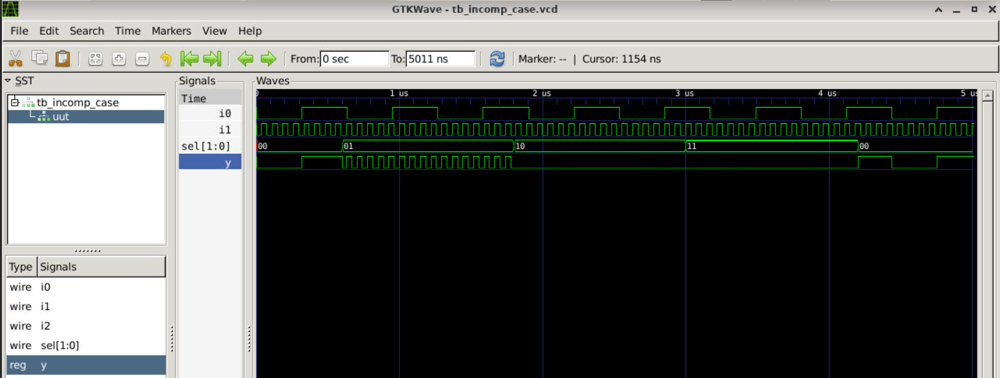
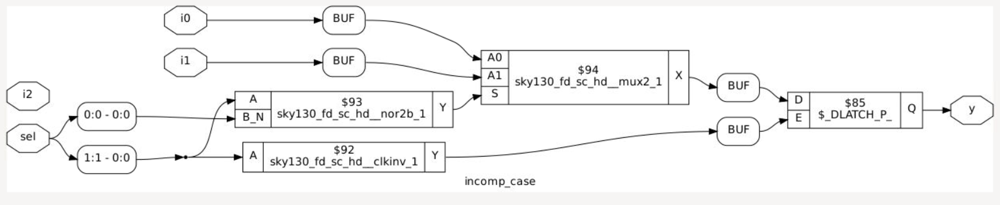
* **Analysis:**
* * **Incomplete Specification:** The `case` statement evaluates a 2-bit selection signal (`sel`), which has 4 possible combinations (`2'b00`, `2'b01`, `2'b10`, `2'b11`). The code only specifies outputs for two conditions.
* **Missing Default Path:** There is no `default` statement to handle the remaining conditions (`2'b10` and `2'b11`).
* **Latch Inference:** Because the output `y` is not assigned a value for all possible states of `sel`, synthesis tools must preserve its previous value during unmapped states. This forces **unintentional transparent latch inference** instead of a clean combinational multiplexer.
* **Unused Inputs:** The input port `i2` is declared in the module header but is entirely omitted inside the `always` block.

  
### Lab 4: Complete Case Statement (`comp_case.v`)
**RTL Source Code:**
```verilog
module comp_case (input i0, input i1, input i2, input [1:0] sel, output reg y);
always @(*) begin
    case(sel)
        2'b00 : y = i0;
        2'b01 : y = i1;
        default : y = i2;
    endcase
end
endmodule
```
**Results & Technical Analysis:**
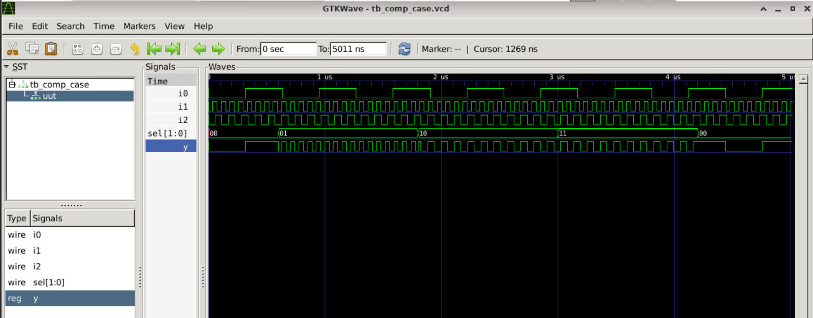
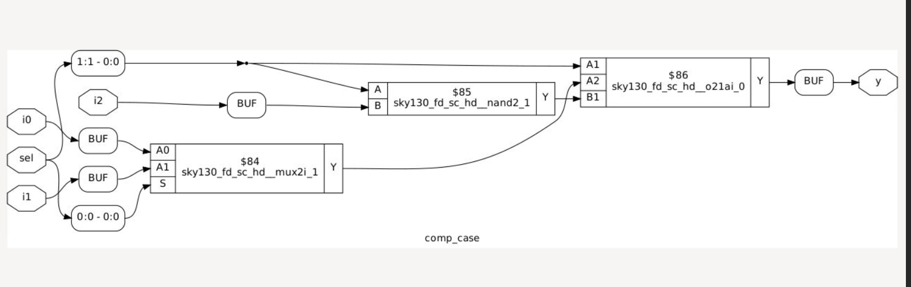
* **Analysis:** This design represents a clean, fully specified multiplexer. By mapping distinct select options (`2'b00`, `2'b01`) and blanketing the remaining space (`2'b10`, `2'b11`) with a explicit `default` path, latch inference is completely avoided. The output maps directly to standard combinational multiplexer cells.

---

### Lab 7: Incomplete Case Handling (`bad_case.v`)
**RTL Source Code:**
```verilog
module bad_case (
    input i0, input i1, input i2, input i3,
    input [1:0] sel,
    output reg y
);
always @(*) begin
    case(sel)
        2'b00: y = i0;
        2'b01: y = i1;
        2'b10: y = i2;
        2'b1?: y = i3; // Wildcard expression usage
    endcase
end
endmodule
```
**Results & Technical Analysis:**
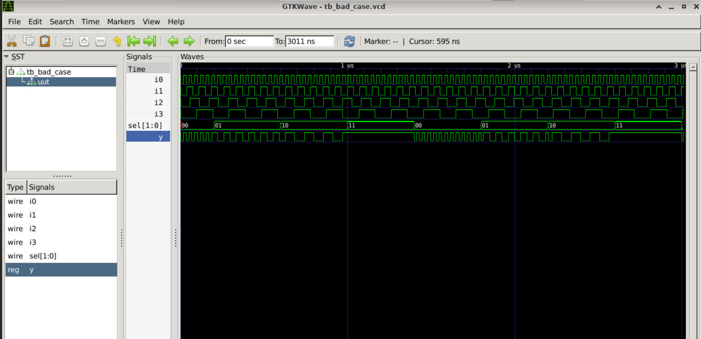
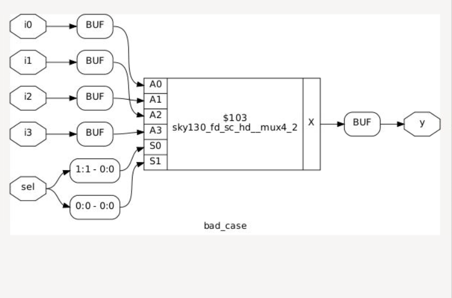
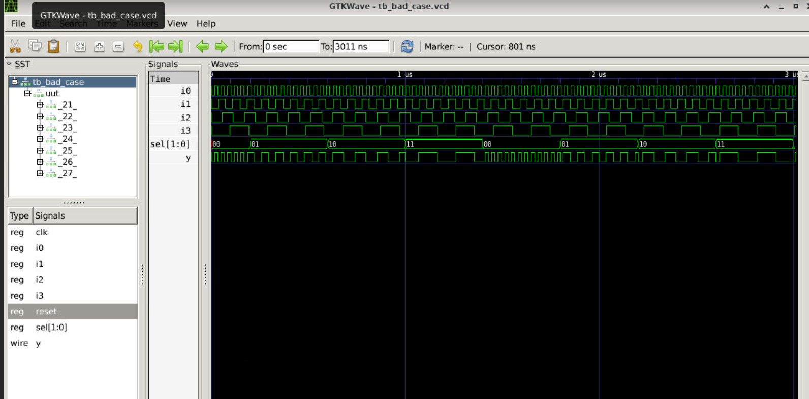
* **Analysis:** Using wildcard or unmapped combinations without a primary `default` path creates holes in the combinational truth table. If `sel` switches to an unhandled matching space during execution, the network latches, producing a synthesis-simulation mismatch.

---

### Lab 8: Partial Assignments in Case (`partial_case_assign.v`)
**RTL Source Code:**
```verilog
module partial_case_assign (
    input i0, input i1, input i2,
    input [1:0] sel,
    output reg y, output reg x
);
always @(*) begin
    case(sel)
        2'b00: begin
            y = i0;
            x = i2;
        end
        2'b01: y = i1; // Missing assignment for 'x'
        default: begin
            x = i1;
            y = i2;
        end
    endcase
end
endmodule
```
**Results & Technical Analysis:**
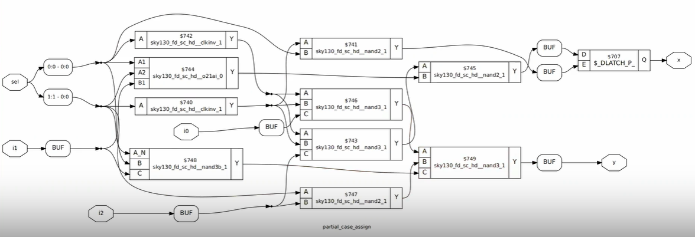
* **Analysis:** This lab illustrates partial variable tracking bugs. Although the case statement handles all `sel` states using a `default` arm, the `2'b01` execution path updates `y` but fails to provide a value for `x`. Consequently, `y` synthesizes to clean combinational gates, while `x` forces the inference of a latch.

---

## 4. For Loops in Verilog
A behavioral `for` loop is used inside procedural loops (`always`) to duplicate block computations. It does **not** create hardware sequentially over time; instead, the synthesis tool unrolls the statements to form concurrent parallel hardware pathways.

### Key Rule
To be synthesizable, the loop limits and loop counter range must be static constants evaluated completely at compile time.

---

## 5. Generate Blocks in Verilog
A `generate` block uses structural loops (`for`, `if-else`, or `case`) to programmatically duplicate hardware objects (like module instantiations, primitive gates, or continuous assignments) during design compilation.

### Key Difference: For Loops vs. Generate Blocks
* **Behavioral `for` loop:** Placed *inside* an execution block (`always`). It handles multiple procedural evaluations of variables.
* **Structural `generate for` block:** Placed *outside* procedural blocks. It acts as an automated hardware duplication script using structural index ranges (`genvar`).

---

### Multiplexer Design: Scalability and Loop-Based Implementations

This section covers the transition from traditional, manual multiplexer implementations to scalable, loop-based structural patterns for large fan-in hardware structures.

---

### Traditional MUX Implementation & The Scalability Problem

When dealing with small multiplexers, explicit behavioral blocks or continuous assignments are highly effective. However, as design dimensions grow, manual code entry becomes impractical.

#### 2-to-1 Multiplexer (2:1 MUX)
* **Behavioral Approach (`always` block):**
  ```verilog
  always @(*) begin
      case(sel)
          1'b0: y = i0;
          1'b1: y = i1;
      endcase
  end
  ```
* **Dataflow Approach (Ternary Operator):**
  A highly efficient single-line continuous assignment alternative:
  ```verilog
  assign y = sel ? i1 : i0;
  ```

#### 4-to-1 Multiplexer (4:1 MUX)
Expanding to 4 inputs increases the control bus to 2 bits, requiring 4 explicit case mapping expressions:
```verilog
always @(*) begin
    case(sel)
        2'b00: y = i0;
        2'b01: y = i1;
        2'b10: y = i2;
        2'b11: y = i3;
    endcase
end
```

#### 32-to-1 Multiplexer (32:1 MUX) — The Coding Bottleneck
* **Manual Expansion:** A 32:1 MUX requires a 5-bit select line (`sel`).
* **Code Overhead:** Developers must write out 32 distinct case statements from `5'b00000` to `5'b11111`.
* **Inherent Risks:** Code expansion introduces significant formatting errors, typos, and maintainability issues.

---

### Advanced Solution: Loop-Based Parameterized Multiplexers

To avoid manual code repetition for high-density components (like 32:1 or 256:1 multiplexers), a procedural `for` loop inside a combinational block should be utilized.

#### RTL Source Code (256-to-1 MUX)
```verilog
integer i;

always @(*) begin
    for (i = 0; i < 256; i = i + 1) begin
        if (i == sel) begin
            y = inp[i];
        end
    end
end
```

#### Technical Design & Synthesis Analysis
* **High Density:** Efficiently instantiates a **256-to-1 Multiplexer** using minimal code lines.
* **Vector Slicing:** Assumes a packed input vector declaration of `input [255:0] inp;`.
* **Loop Unrolling:** Synthesis tools unroll the loop during compilation to build a pure combinational tree.
* **Hardware Mapping:** The condition expression (`i == sel`) maps directly to hardware decoder gates routing to data path gates.

### Parameterized Demultiplexer using For-Loops

Just like multiplexers, wide Demultiplexers (DEMUX) can be implemented using a procedural `for` loop inside a combinational block to keep code clean and scalable.

#### RTL Source Code (1x8 DEMUX)
```verilog
integer i;

always @(*) begin
    // Crucial: Default assignment to prevent latch inference
    op_bus[7:0] = 8'b0; 
    
    for (i = 0; i < 8; i = i + 1) begin
        if (i == sel) begin
            op_bus[i] = input;
        end
    end
end
```

#### Technical Design & Evaluation Analysis
* **Design Structure:** This represents a **1-to-8 Demultiplexer (1x8 DEMUX)** routing a single 1-bit input signal to one of eight output channels.
* **Interface Specification:** 
  * `input`: 1-bit data input.
  * `sel[2:0]`: 3-bit selection lines.
  * `op_bus[7:0]`: 8-bit packed output bus.
* **Evaluation Logic:** 
  * The line `op_bus[7:0] = 8'b0;` is vital. It pre-assigns all outputs to zero before evaluation, ensuring unselected channels do not hold state, avoiding **unintentional latch inference**.
  * When a specific index `i` matches `sel`, that explicit lane of the bus connects directly to the incoming data `input`, while all other lanes remain securely tied to `0`.
* **Conclusion:** For configuring highly wide MUX or DEMUX networks, the procedural `for` statement is exceptionally handy and reduces code verbosity.


### Structural Hardware Replication: `generate` Loops

While a procedural `for` loop inside an `always` block describes **combinational logic behavior**, a `generate` loop is used **outside `always` blocks** to dynamically replicate actual hardware structures, module instances, or primitives.

#### The Problem: Manual Hardware Replication
If you need to instantiate multiple identical hardware cells (for example, eight 2-input AND gates), manually typing each instance becomes repetitive and unscalable:
```verilog
and u_and1 (.a(in[0]), .b(in2[0]), .y(y[0]));
and u_and2 (.a(in[1]), .b(in2[1]), .y(y[1]));
// ... repeating up to u_and8
```

#### The Solution: `generate` block with `genvar`
Using a `generate` block allows you to programmatically replicate modules or primitives across bus vectors cleanly.

```verilog
// Replicating HW using for-generate (Outside always block)
genvar i;

generate
    for (i = 0; i < 8; i = i + 1) begin : gate_gen
        and u_and (.a(in[i]), .b(in2[i]), .y(y[i]));
    end
endgenerate
```

#### Technical Design & Syntax Analysis
* **Replication of HW:** The elaboration tool duplicates the underlying logic gates across the specified bounds (generating indices `[0]` through `[7]`).
* **`genvar` Requirement:** Unlike simulation loops that use a standard `integer`, structural loops require a special `genvar` loop index variable that exists only during compilation.
* **Named Blocks:** Inside a `generate` loop, the `begin` statement requires a block name (e.g., `: gate_gen`). The compiler uses this label to generate unique hierarchical instance names like `gate_gen[0].u_and`, `gate_gen[1].u_and`, etc.

## 6. Ripple Carry Adder (RCA)

A Ripple Carry Adder (RCA) chains multiple Full Adder (FA) blocks sequentially. The carry output (\(C_{out}\)) of one block ripples directly into the carry input (\(C_{in}\)) of the next block.

#### Mathematical Operation Example
Adding two 3-bit binary numbers (\(NUM1 = 111_2\), \(NUM2 = 001_2\)):
```text
  Carries:  1 1 1 
  NUM1:       1 1 1   (7 in decimal)
  NUM2:     + 0 0 1   (1 in decimal)
  -----------------
  Result:   1 0 0 0   (8 in decimal) -> Sum[2:0] = 000, Final Carry = 1
```

#### Structural Architecture Diagram
The block schematic shows a series of cascaded Full Adder cells handling parallel bit positions:

```text
               NUM1[2] NUM2[2]     NUM1[1] NUM2[1]     NUM1[0] NUM2[0]
                  │       │           │       │           │       │
               ┌──▼───────▼──┐     ┌──▼───────▼──┐     ┌──▼───────▼──┐
Final Carry ◄──┤ Full Adder  ◄─────┤ Full Adder  ◄─────┤ Full Adder  ◄─── Ground (0)
(Sum[3])       └───┬─────────┘     └───┬─────────┘     └───┬─────────┘
                   │                   │                   │
                   ▼                   ▼                   ▼
                Sum[2]              Sum[1]              Sum[0]
```

#### Hardware Design Implementation Focus
* **Replicated Instances:** A single Full Adder (`FA`) hardware module is instantiated iteratively.
* **Optimized Syntax:** Instead of manually chaining signals across distinct lines, a **`for generate`** block should be used to describe this iterative hardware cascade dynamically.


---

## 7. Labs on Loops and Generate Blocks

### Lab 9: 4-to-1 MUX Using For Loop (`mux_generate.v`)
**RTL Source Code:**
```verilog
module mux_generate (
    input i0, input i1, input i2, input i3,
    input [1:0] sel,
    output reg y
);
wire [3:0] i_int;
assign i_int = {i3, i2, i1, i0};
integer k;
always @(*) begin
    y = 1'b0; // Default anchor assignment to prevent latching
    for (k = 0; k < 4; k = k + 1) begin
        if (k == sel)
            y = i_int[k];
    end
end
endmodule
```
**Results & Technical Analysis:**
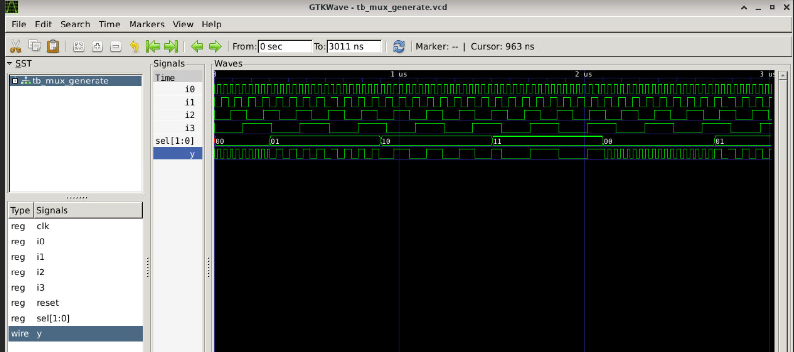
* **Analysis:** The synthesis engine fully unrolls the loop counter range from $0$ to $3$. The underlying hardware parses the sequential `if` branches into a fast parallel combinational decoder tree structure, resulting in a glitch-free multiplexer.

---

### Lab 10: 8-to-1 Demux Using Case (`demux_case.v`)
**RTL Source Code:**
```verilog
module demux_case (
    output o0, output o1, output o2, output o3,
    output o4, output o5, output o6, output o7,
    input [2:0] sel,
    input i
);
reg [7:0] y_int;
assign {o7, o6, o5, o4, o3, o2, o1, o0} = y_int;
always @(*) begin
    y_int = 8'b0;
    case(sel)
        3'b000 : y_int[0] = i;
        3'b001 : y_int[1] = i;
        3'b010 : y_int[2] = i;
        3'b011 : y_int[3] = i;
        3'b100 : y_int[4] = i;
        3'b101 : y_int[5] = i;
        3'b110 : y_int[6] = i;
        3'b111 : y_int[7] = i;
    endcase
end
endmodule
```
**Results & Technical Analysis:**
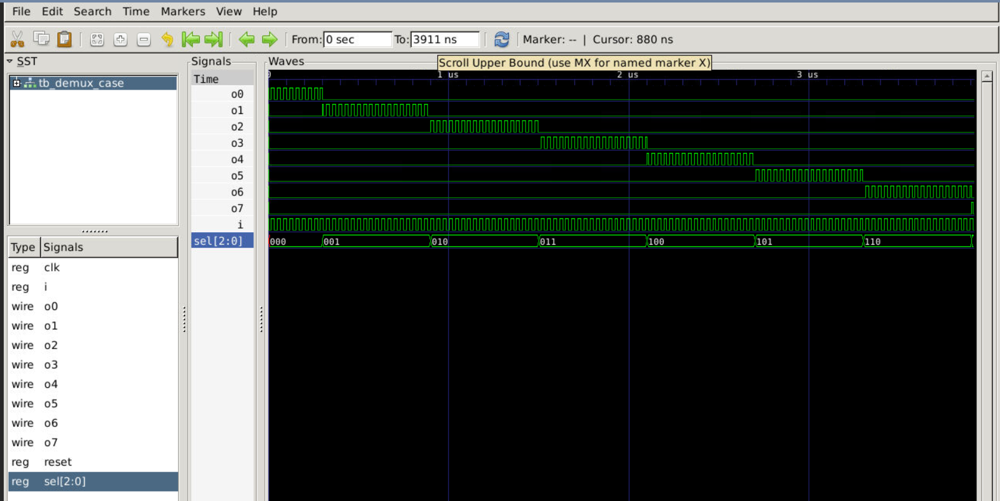
* **Analysis:** Explicitly listing all 8 combinations of the 3-bit selection vector maps the hardware directly to clear, independent gating cells, routing the primary input `i` to the selected output port with zero storage overhead.

---

### Lab 11: 8-to-1 Demux Using For Loop (`demux_generate.v`)
**RTL Source Code:**
```verilog
module demux_generate (
    output o0, output o1, output o2, output o3,
    output o4, output o5, output o6, output o7,
    input [2:0] sel,
    input i
);
reg [7:0] y_int;
assign {o7, o6, o5, o4, o3, o2, o1, o0} = y_int;
integer k;
always @(*) begin
    y_int = 8'b0;
    for (k = 0; k < 8; k = k + 1) begin
        if (k == sel)
            y_int[k] = i;
    end
end
endmodule
```
**Results & Technical Analysis:**
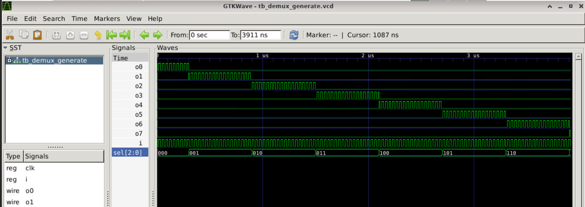
* **Analysis:** The synthesis engine rolls out the 8 individual loop conditions into a parallel comparator fabric. This produces an identical gate network to the explicit case statement, proving that looping constructs optimize down to clean combinational decoders.

---

### Lab 12: 8-bit Ripple Carry Adder with Generate Block (`rca.v`)

This implementation demonstrates a hybrid structural approach using an explicit instantiation for the Least Significant Bit (LSB) and a `generate` loop to instantiate and chain the remaining bits.

#### Complete Source Code

```verilog
module rca (input [7:0] num1, input [7:0] num2, output [8:0] sum);
wire [7:0] int_sum;
wire [7:0] int_co;

genvar i;
generate
    for (i = 1; i < 8; i = i + 1) begin : fa_loop
        fa u_fa_1 (
            .a(num1[i]),
            .b(num2[i]),
            .c(int_co[i-1]),
            .co(int_co[i]),
            .sum(int_sum[i])
        );
    end
endgenerate

// Explicit instantiation for the LSB (Bit 0) to handle initial Carry-In (1'b0)
fa u_fa_0 (
    .a(num1[0]),
    .b(num2[0]),
    .c(1'b0),
    .co(int_co[0]),
    .sum(int_sum[0])
);

// Continuous assignments to map internal structures to the 9-bit output port
assign sum[7:0] = int_sum;
assign sum[8]   = int_co[7];

endmodule

// Helper Module: Behavioral 1-bit Full Adder Cell
module fa (input a, input b, input c, output co, output sum);
    assign {co, sum} = a + b + c;
endmodule
```

**Results & Technical Analysis:**
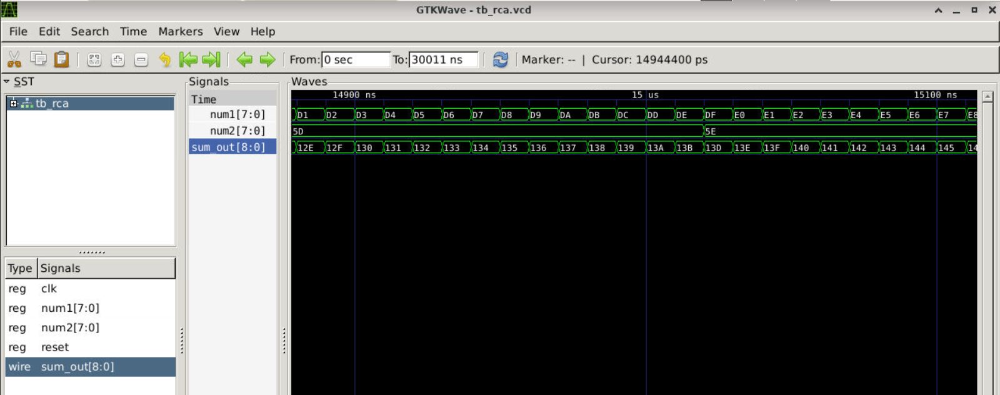
* **Loop Boundaries:** The `generate` block loops from `i = 1` up to `i = 7`. This prevents an out-of-bounds error on the wire array tracking previous indices (`int_co[i-1]`).
* **Interconnect Wires:** 
  * `int_sum`: Tracks the isolated 8-bit sum bits generated by individual cells.
  * `int_co`: Routes the carry chain, establishing the sequential "ripple" effect across the adder blocks.
* **Output Port Alignment:** The `sum` output is deliberately scaled to `[8:0]` (9 bits total) to inherently capture the final carry-out bit (`sum[8]`) alongside the 8-bit computational sum array without truncation.
