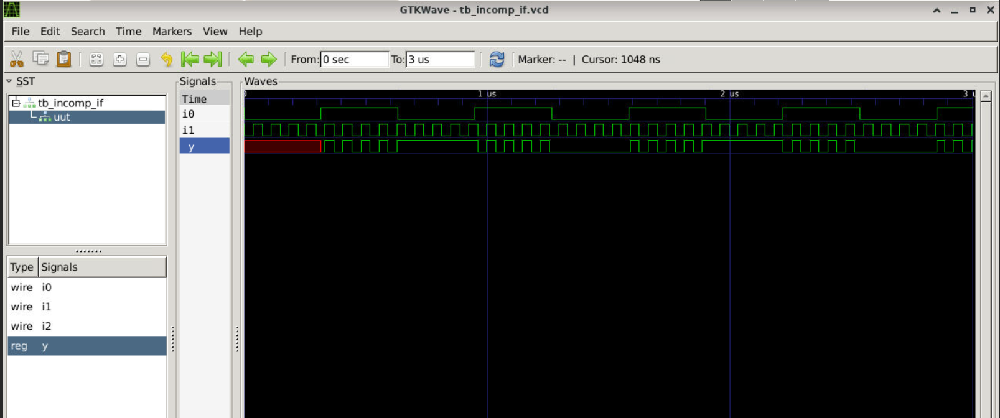
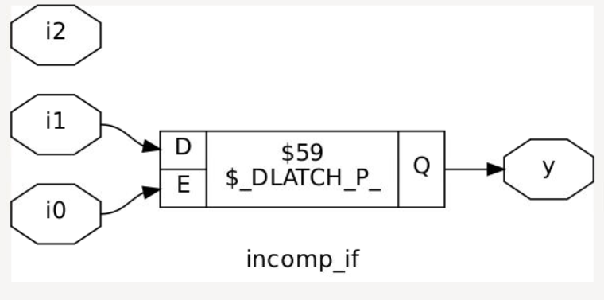
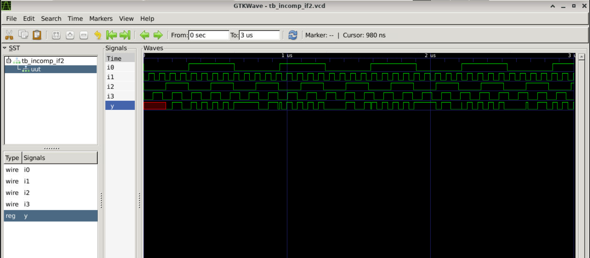
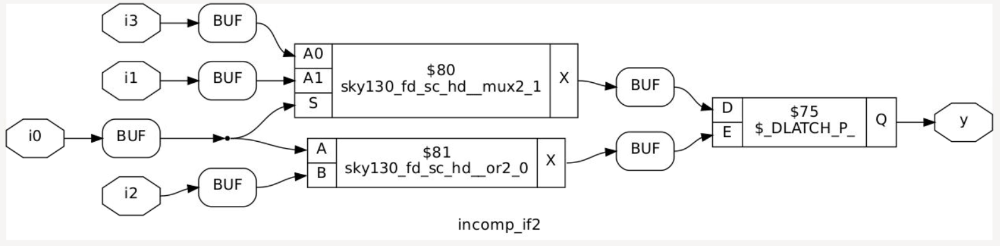

# Day 5: Optimization in Synthesis

## 1. Conditional Statements in Verilog

### 1a. If-Else Statements
`if-else` statements handle conditional execution inside procedural blocks (`always`, `initial`, `task`, or `function`). They synthesize into **priority-encoded logic** using a cascading multiplexer chain.

#### Syntax
```verilog
// Standard If-Else
if (condition) begin
    // Executed if condition is true
end else begin
    // Executed if condition is false
end

// Nested If-Else (Priority Tree)
if (condition1) begin
    // Executed if condition1 is true (highest priority)
end else if (condition2) begin
    // Executed if condition2 is true
end else begin
    // Executed if no previous conditions match
end
```

* **Priority Execution**: Conditions process sequentially from top to bottom.
* **Mutual Exclusion**: Only the first branch evaluating to true executes.

---

### 1b. Case Statements
`case` statements compare an expression against multiple values. They synthesize into parallel-evaluation structures (a single large multiplexer) rather than a priority tree.

#### Syntax
```verilog
case (expression)
    value1: begin
        // Executed if expression == value1
    end
    value2: begin
        // Executed if expression == value2
    end
    default: begin
        // Executed if no matches are found
    end
endcase
```

📌 **Data Type Rule**: Any variable assigned a value inside an `if-else` or `case` block within a procedural block must be declared as a `reg` type.

---

## 2. Deep Dive: Case Statement Caveats

### ⚠️ Caveat 1: Incomplete Case Statements
An incomplete case statement occurs when some input permutations of the selection signal are completely omitted, and no fallback branch exists.

* **The Problem**: For a 2-bit selection signal (`reg [1:0] sel`), 4 states exist (`00`, `01`, `10`, `11`). Mapping only `2'b00` and `2'b01` leaves the remaining states undefined.
* **The Fix**: Always provide a `default` statement to safely trap unmapped states and keep logic combinational.

```verilog
// BAD: Omitted states infer a latch
case(sel)
    2'b00: out = c1;
    2'b01: out = c2;
endcase

// GOOD: Safe fallback
case(sel)
    2'b00: out = c1;
    2'b01: out = c2;
    default: out = 1'b0; 
endcase
```

### ⚠️ Caveat 2: Partial Assignments
A partial assignment happens when an output variable is specified in one branch of a `case` statement but forgotten in another.

* **The Problem**: If `x` and `y` are outputs, but `y` is left out of the `2'b01` branch, the synthesis tool forces a hardware loop to retain the last value of `y`.
* **The Fix**: Explicitly map every single output variable in every single branch segment.

```verilog
// Example of partial assignment causing a latch on output 'y'
always @(*) begin
    case(sel)
        2'b00 : begin
            x = a;
            y = b;
        end
        2'b01 : begin
            x = c;
            // y is missing here!
        end
        default : begin
            x = d;
            y = b;
        end
    endcase
end
```

### ⚠️ Caveat 3: Overlapping Case Expressions & Bad Don't Cares
Using overlapping values or bad wildcard markers (`?`) creates competing conditions that simulate differently than they synthesize.

* **The Problem**: If `sel = 2'b10`, it matches both `2'b10` and `2'b1?` simultaneously.
* **The Consequence**: Simulation checks branches top-to-bottom, while synthesis builds parallel evaluation. This mismatch yields **unpredictable outputs** in hardware.
* **The Fix**: Ensure all case expressions are strictly mutually exclusive. Use `if-else-if` structures if priority is required.

```verilog
// DANGEROUS: Causes unpredictable hardware behavior
case(sel)
    2'b00 : out = a;
    2'b01 : out = b;
    2'b10 : out = c; // Overlaps with the line below!
    2'b1? : out = d; 
endcase
```

---

## 3. Inferred Latches in Verilog

### Cause of Latch Inference
In combinational modeling (`always @(*)`), a level-triggered hardware latch is unintentionally inferred when a variable is not assigned a value across all possible execution paths. When a path is left unspecified, the synthesis tool must retain the variable's previous state, creating an unwanted memory element.

### Resolution
* Assign values to every output variable under every execution branch.
* Alternatively, specify a safe default assignment at the very top of the procedural block.

```verilog
always @(*) begin
    // Safe default assignments prevent latches
    x = 1'b0;
    y = 1'b0;
    
    if (condition) begin
        x = a;
    end // Missing 'else' will NOT cause a latch now
end
```

### Exception: Incomplete If-Else in Sequential Logic
Incomplete conditional paths are perfectly acceptable and standard practice within **sequential logic blocks** (`always @(posedge clk)`). Instead of an unwanted latch, the synthesis tool cleanly infers a **D Flip-Flop with a Clock Enable pin**.

#### Example: 3-Bit Counter
```verilog
module counter_3bit (
    input  wire       clk,   // Clock signal
    input  wire       reset, // Asynchronous reset
    input  wire       en,    // Count enable
    output reg  [2:0] count  // 3-bit count output
);

    // Sequential logic block
    always @(posedge clk or posedge reset) begin
        if (reset) begin
            count <= 3'b000;
        end else if (en) begin
            count <= count + 3'b001;
        end
        // No explicit 'else' needed. 
        // Holds value safely on a D-FF when 'en' is low.
    end
endmodule
```

## 3. Labs for If-Else and Case Statements

### Lab 1: Incomplete If Statement (`incomp_if.v`)
**RTL Source Code:**
```verilog
module incomp_if (input i0, input i1, input i2, output reg y);
always @(*) begin
    if (i0)
        y <= i1;
end
endmodule
```
**Results & Technical Analysis:**


* **Analysis:** The `if` statement lacks an `else` clause. If `i0` is false, `y` must hold its value. As a result, the synthesis engine infers a level-triggered latch (`sky130_fd_sc_hd__dlxtp`) instead of pure combinational gates.

---

### Lab 2: Nested If-Else (`incomp_if2.v`)
**RTL Source Code:**
```verilog
module incomp_if2 (input i0, input i1, input i2, input i3, output reg y);
always @(*) begin
    if (i0)
        y <= i1;
    else if (i2)
        y <= i3;
end
endmodule
```
**Results & Technical Analysis:**


* **Analysis:** While this nested structure builds a cascading priority line, it still lacks a final fallback `else` statement. If both `i0` and `i2` evaluate to false, `y` drops into hold-state, generating an inferred latch in the synthesis netlist.

---

### Lab 3: Complete Case Statement (`comp_case.v`)
**RTL Source Code:**
```verilog
module comp_case (input i0, input i1, input i2, input [1:0] sel, output reg y);
always @(*) begin
    case(sel)
        2'b00 : y = i0;
        2'b01 : y = i1;
        default : y = i2;
    endcase
end
endmodule
```
**Results & Technical Analysis:**


* **Analysis:** This design represents a clean, fully specified multiplexer. By mapping distinct select options (`2'b00`, `2'b01`) and blanketing the remaining space (`2'b10`, `2'b11`) with a explicit `default` path, latch inference is completely avoided. The output maps directly to standard combinational multiplexer cells.

---

### Lab 7: Incomplete Case Handling (`bad_case.v`)
**RTL Source Code:**
```verilog
module bad_case (
    input i0, input i1, input i2, input i3,
    input [1:0] sel,
    output reg y
);
always @(*) begin
    case(sel)
        2'b00: y = i0;
        2'b01: y = i1;
        2'b10: y = i2;
        2'b1?: y = i3; // Wildcard expression usage
    endcase
end
endmodule
```
**Results & Technical Analysis:**


* **Analysis:** Using wildcard or unmapped combinations without a primary `default` path creates holes in the combinational truth table. If `sel` switches to an unhandled matching space during execution, the network latches, producing a synthesis-simulation mismatch.

---

### Lab 8: Partial Assignments in Case (`partial_case_assign.v`)
**RTL Source Code:**
```verilog
module partial_case_assign (
    input i0, input i1, input i2,
    input [1:0] sel,
    output reg y, output reg x
);
always @(*) begin
    case(sel)
        2'b00: begin
            y = i0;
            x = i2;
        end
        2'b01: y = i1; // Missing assignment for 'x'
        default: begin
            x = i1;
            y = i2;
        end
    endcase
end
endmodule
```
**Results & Technical Analysis:**


* **Analysis:** This lab illustrates partial variable tracking bugs. Although the case statement handles all `sel` states using a `default` arm, the `2'b01` execution path updates `y` but fails to provide a value for `x`. Consequently, `y` synthesizes to clean combinational gates, while `x` forces the inference of a latch.

---

## 4. For Loops in Verilog
A behavioral `for` loop is used inside procedural loops (`always` or `initial`) to duplicate block computations. It does **not** create hardware sequentially over time; instead, the synthesis tool unrolls the statements to form concurrent parallel hardware pathways.

### Key Rule
To be synthesizable, the loop limits and loop counter range must be static constants evaluated completely at compile time.

---

## 5. Generate Blocks in Verilog
A `generate` block uses structural loops (`for`, `if-else`, or `case`) to programmatically duplicate hardware objects (like module instantiations, primitive gates, or continuous assignments) during design compilation.

### Key Difference: For Loops vs. Generate Blocks
* **Behavioral `for` loop:** Placed *inside* an execution block (`always`). It handles multiple procedural evaluations of variables.
* **Structural `generate for` block:** Placed *outside* procedural blocks. It acts as an automated hardware duplication script using structural index ranges (`genvar`).

---

## 6. What is a Ripple Carry Adder (RCA)?
A **Ripple Carry Adder (RCA)** computes the binary sum of two $N$-bit numbers by cascading $N$ Full Adder structural instances in a chain. 

The carry output signal ($C_{out}$) generated by each individual full adder stage hooks directly into the input carry pin ($C_{in}$) of the subsequent higher-significant bit stage. The computation "ripples" sequentially across the hardware from the Least Significant Bit (LSB) up to the Most Significant Bit (MSB).


---

## 7. Labs on Loops and Generate Blocks

### Lab 9: 4-to-1 MUX Using For Loop (`mux_generate.v`)
**RTL Source Code:**
```verilog
module mux_generate (
    input i0, input i1, input i2, input i3,
    input [1:0] sel,
    output reg y
);
wire [3:0] i_int;
assign i_int = {i3, i2, i1, i0};
integer k;
always @(*) begin
    y = 1'b0; // Default anchor assignment to prevent latching
    for (k = 0; k < 4; k = k + 1) begin
        if (k == sel)
            y = i_int[k];
    end
end
endmodule
```
**Results & Technical Analysis:**

* **Analysis:** The synthesis engine fully unrolls the loop counter range from $0$ to $3$. The underlying hardware parses the sequential `if` branches into a fast parallel combinational decoder tree structure, resulting in a glitch-free multiplexer.

---

### Lab 10: 8-to-1 Demux Using Case (`demux_case.v`)
**RTL Source Code:**
```verilog
module demux_case (
    output o0, output o1, output o2, output o3,
    output o4, output o5, output o6, output o7,
    input [2:0] sel,
    input i
);
reg [7:0] y_int;
assign {o7, o6, o5, o4, o3, o2, o1, o0} = y_int;
always @(*) begin
    y_int = 8'b0;
    case(sel)
        3'b000 : y_int[0] = i;
        3'b001 : y_int[1] = i;
        3'b010 : y_int[2] = i;
        3'b011 : y_int[3] = i;
        3'b100 : y_int[4] = i;
        3'b101 : y_int[5] = i;
        3'b110 : y_int[6] = i;
        3'b111 : y_int[7] = i;
    endcase
end
endmodule
```
**Results & Technical Analysis:**

* **Analysis:** Explicitly listing all 8 combinations of the 3-bit selection vector maps the hardware directly to clear, independent gating cells, routing the primary input `i` to the selected output port with zero storage overhead.

---

### Lab 11: 8-to-1 Demux Using For Loop (`demux_generate.v`)
**RTL Source Code:**
```verilog
module demux_generate (
    output o0, output o1, output o2, output o3,
    output o4, output o5, output o6, output o7,
    input [2:0] sel,
    input i
);
reg [7:0] y_int;
assign {o7, o6, o5, o4, o3, o2, o1, o0} = y_int;
integer k;
always @(*) begin
    y_int = 8'b0;
    for (k = 0; k < 8; k = k + 1) begin
        if (k == sel)
            y_int[k] = i;
    end
end
endmodule
```
**Results & Technical Analysis:**

* **Analysis:** The synthesis engine rolls out the 8 individual loop conditions into a parallel comparator fabric. This produces an identical gate network to the explicit case statement, proving that looping constructs optimize down to clean combinational decoders.

---

### Lab 12: 8-bit Ripple Carry Adder with Generate Block (`rca.v`)
